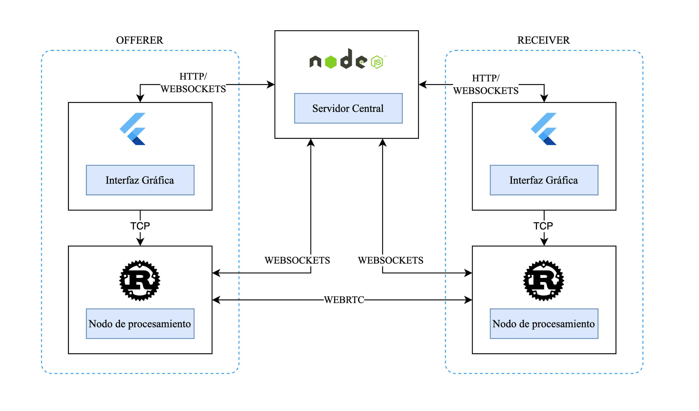

## Decentralized Cloud Gaming Rental Service

Servicio descentralizado de Cloud Gaming donde los usuarios pueden alquilar juegos y jugar en la nube.
La arquitectura se basa en una solución integrada que combina una aplicación de escritorio desarrollada en Flutter, un programa en Rust encargado del procesamiento intensivo y un backend monolítico construido en Node.js.

## Repositorios

[Servidor Central](https://github.com/Tpp-Cloud-Gaming/server)

[Nodo de procesamiento](https://github.com/Tpp-Cloud-Gaming/processing_node)

[Interfaz Grafica](https://github.com/Tpp-Cloud-Gaming/desktop_frontend)

## Arquitectura

